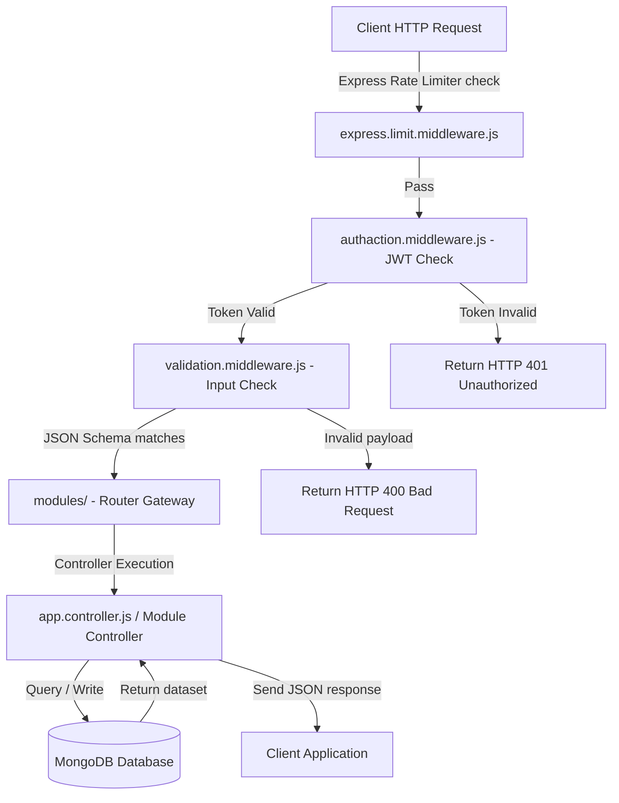

# Ataa Charity Platform API: Enterprise-Grade REST API & Cron Automation Engine

<div align="center">
  
</div>

<div align="center">
      
</div>

خادم **منصة عطاء البرمجي** هو محرك سحابي متكامل مبني باستخدام Node.js و Express لإدارة حسابات المتبرعين والجمعيات الشريكة، وتتبع حملات التبرع وإصدار تقارير التقييم، بالإضافة إلى محرك جدولة (Cron) للعمليات المؤتمتة.

This repository holds the backend Express.js RESTful API, database schemas, utility helper bundles, and cron job schedulers for the **Ataa Smart Charity Ecosystem**. Optimized for Vercel serverless deployments.

---

## 🧬 API Request Processing Lifecycle

The backend coordinates middlewares, validations, and secure controllers dynamically:



---

## 🧬 Backend Architecture & Core Modules

1.  **API Routing Gateway (`index.js`, `app.controller.js`)**: Main route setup binding all core features.
2.  **Cron Scheduler Engine (`src/cron/`)**: Handles automated background services (`cron.services.js`, `cron.endpoint.js`) like campaign limits checks and database cleanups.
3.  **Middlewares (`src/middleware/`)**:
    *   `authaction.middleware.js` / `authorization.middleware.js`: Access tokens and RBAC checkers.
    *   `express.limit.middleware.js`: DDOS safety rate-limiting.
    *   `validation.middleware.js`: Payload schema validation layers.
4.  **Operational Modules (`src/modules/`)**:
    *   `auth` / `user`: Profiles and onboarding logic.
    *   `donation`: Donation transaction records, campaign targets, and statistics.
    *   `charity` / `charity_dashboard`: Non-profit catalogs and approval registries.
    *   `evaluation` / `report`: Campaigns telemetry and metrics reports.
    *   `ai`: AI Chatbot assistance endpoint logic.
5.  **Utilities (`src/utils/`)**: Mappings for `encryption`, `hashing`, `sendemails` (SMTP updates), and `uploadfile` (Cloudinary/Local uploads).

---

## 🛠️ Technology Stack & Architectures

*   **Runtime Backend**: **Node.js v18+**.
*   **API Framework**: **Express.js** route adapters.
*   **Database Engine**: **MongoDB** document database using Mongoose ORM.
*   **Deployments**: Serverless deployment configurations targeting **Vercel** (`vercel.json`).

---

## 📂 Repository Module Layout

```text
Ataa-Charity-Platform-API/
├── src/
│   ├── cron/            # Cron services, cron endpoints, and automation logic
│   ├── database/        # Mongoose database models and connect setups
│   ├── middleware/      # Auth checks, pagination, rate limiters, validations
│   ├── modules/         # Feature modules (AI, Donation, Auth, User, Evaluation)
│   ├── utils/           # Automation helpers, hashing, encryption, email senders
│   └── app.controller.js# Main app controller
├── index.js             # Main server startup entry point
├── package.json         # Project dependencies manifest
├── vercel.json          # Vercel serverless deployment setup
└── README.md            # System documentation
```

---

## ⚡ Local Setup & Run

### 📋 Prerequisites
* Node.js v18+ and MongoDB local instance / Atlas connection

### ⚙️ Quick Start Steps
```bash
# 1. Clone the API repository
git clone https://github.com/Ataa-Charity-Viewer-Team/Ataa-Charity-Platform-API.git
cd Ataa-Charity-Platform-API

# 2. Install dependencies
npm install

# 3. Configure Env Variables
# Create .env and set MONGO_URI, JWT_SECRET, SMTP_HOST, and API keys

# 4. Start the server (Development mode)
npm start
```

---

## 📄 License
Licensed under the **MIT License**.
